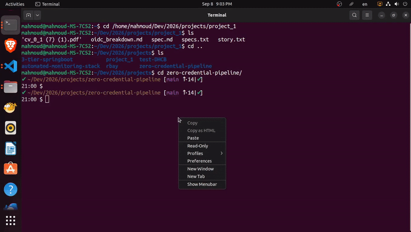
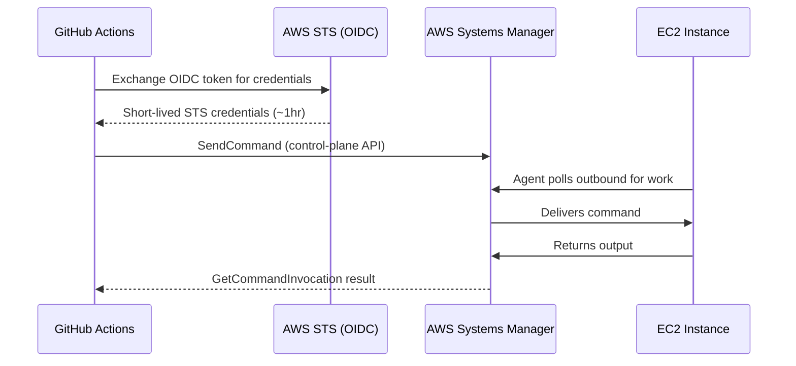
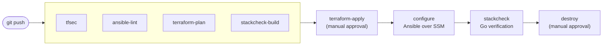

# Zero-Credential Infrastructure Pipeline

A GitHub Actions pipeline that provisions a complete AWS observability stack
(Prometheus, Grafana, node_exporter) with **zero stored credentials, zero
SSH access, and zero open inbound ports**, and does not call the deployment
done until a purpose-built verification tool proves the stack actually
works.



## The problem this solves

Standing up an observability stack by hand (provisioning a host, opening
access to it, installing and wiring together Prometheus, Grafana, and an
exporter, then actually confirming the dashboard is showing real data) is a
half-day of manual work, and it usually leaves behind long-lived SSH keys or
static cloud credentials sitting in a CI secret somewhere.

This pipeline does the same job in **5 minutes 17 seconds** from `terraform
apply` to a fully configured, running stack, with no credential of any kind
persisted anywhere.

## Results

| | |
|---|---|
| Time to provision + configure the full stack | **5m 17s** |
| Long-lived credentials stored in CI | **0** |
| SSH keys required | **0** |
| Open inbound ports on the instance | **0** |
| Manual approval gates | **2** (provision, teardown) |

The 5m17s figure covers Terraform provisioning through full Ansible
configuration of all three services. It excludes static analysis checks and
the idempotency-verification run, which are CI quality gates, not part of
the deployment itself.

## How it works

### Zero credentials, zero exposure

There are no AWS access keys anywhere in this repository or its CI
configuration. Each job mints a signed OIDC token identifying itself to
GitHub's own token issuer (`token.actions.githubusercontent.com`), which an
IAM OIDC identity provider in AWS trusts. The IAM role's trust policy
(`bootstrap/oidc.tf`) only allows `sts:AssumeRoleWithWebIdentity` if the
token's `sub` claim matches one of three exact, immutable-ID-scoped values:
```
repo:{owner}@{ownerId}/{repo}@{repoId}:ref:refs/heads/main
repo:{owner}@{ownerId}/{repo}@{repoId}:environment:provision
repo:{owner}@{ownerId}/{repo}@{repoId}:environment:teardown
```
So a token minted for a push to `main`, or for a job running under the
`provision`/`teardown` environments, is the only thing that can assume the
role, and only in this repository. The resulting STS credentials expire in
about an hour and are never stored anywhere.

The EC2 instance itself has no SSH daemon exposed and its security group has
no inbound rules at all. Every configuration and verification step reaches
it exclusively through AWS Systems Manager's control plane. The instance's
SSM agent polls **outbound** for work, and nothing ever connects **in**.



### The pipeline



Four independent checks (a security scan via `tfsec`, a lint pass via
`ansible-lint`, a Terraform plan, and a build of the verification tool) run
in parallel and gate everything downstream. `terraform-apply` requires a
human to approve before any real infrastructure is created. `configure`
applies four Ansible roles over SSM and confirms a second run reports no
drift. `stackcheck` then runs as its own containerized job. `destroy`
requires a second, separate human approval, so infrastructure is never left
running unattended.

#### Configuration (Ansible over SSM)

Ansible reaches the instance the same way everything else does: a
tag-based dynamic inventory (`ansible/inventory/aws_ec2.yml`) discovers it
by the `Project` tag, and the `community.aws.aws_ssm` connection plugin
runs every task through the SSM channel, no SSH involved at any point.

- **`common`**: base packages, a dedicated non-root system user, UTC
  timezone.
- **`node_exporter`**: downloads the pinned release, verifies it against a
  known-good SHA256 checksum, installs it as a systemd service.
- **`prometheus`**: same checksum-verified binary pattern, renders a
  scrape config from a template (self-scrape plus `node_exporter`),
  validates it with `promtool` before the service reloads.
- **`grafana`**: installs from Grafana's own signed RPM repository,
  auto-provisions the Prometheus datasource via Grafana's file-based
  provisioning so it's wired up the moment the service starts, not a
  manual step through the UI.

### Viewing the live stack

Grafana and Prometheus are reachable the same zero-inbound way as
everything else, an SSM port-forward tunnel, not a new access path opened
up just for viewing dashboards:

```
aws ssm start-session --target <instance-id> \
  --document-name AWS-StartPortForwardingSession \
  --parameters '{"portNumber":["3000"],"localPortNumber":["3000"]}'
```

then open `http://localhost:3000` (Grafana; swap `3000` for `9090` for
Prometheus directly). `<instance-id>` comes straight out of the
`terraform-apply` job's log (`terraform output instance_id`).

### Verification, not just deployment

Config management reporting success and the software actually working are
different claims. `stackcheck` (`stackcheck/`) is a Go tool built to close
that gap: it queries Grafana's own datasource-proxy endpoint (the same path
a real dashboard panel uses) and confirms a live value traces all the way
through Prometheus to node_exporter, rather than checking that three ports
independently answer `200`.

It's built as four layers, and only the outermost one knows anything about
Grafana or Prometheus by name:

```
internal/check/           generic engine: Checker interface, Result, Runner
internal/executor/        how to reach a target and run a command (SSM today)
internal/discovery/       how to find a target (EC2 tag today)
internal/checks/          the checks for one specific stack (observability)
internal/app/             wiring: CLI flags, registries, orchestration
```

`--stack`, `--discovery`, and `--executor` are three independently
selectable flags, each backed by its own registry. Verifying a different
piece of software, or reaching a target through a different networking
model (SSH, `kubectl exec`), is a new file plus one registry entry. The
engine, discovery, and reporting layers never change. Output is JSON by
default (an `overall_status` and per-check `Result`, so a downstream step
can consume it directly), with a human-readable table available via
`--format text`.

## Engineering challenges resolved

Two non-obvious issues came up during development, both caused by upstream
tooling behaving unexpectedly and diagnosed from first principles rather
than worked around:

**A silently-lying Ansible module.** `ansible.builtin.dnf` reported a
successful Grafana package install as a failed "already installed"
transaction, on every fresh instance, on the very first install attempt.
Reading the target's `dnf.log` directly showed the RPM transaction had, in
fact, completed cleanly. The failure was in the module's own Python API
integration on Amazon Linux 2023's dnf4 bindings, re-checking its own
just-committed change against a stale view of the package database. Fixed
by shelling out to the `dnf` CLI directly with an explicit idempotency
guard, bypassing the broken code path entirely.

**A Grafana API version incompatibility.** The Grafana datasource-proxy
query needed to prove the metrics chain kept 404ing. Grafana 13.x turned out
to require the datasource's UID in that URL path, not the legacy numeric ID
every older example online still uses. This was found by testing the live
API directly rather than trusting documentation, and fixed by resolving the
UID at runtime instead of hardcoding an assumption about the URL shape.

## Repository structure

```
bootstrap/    One-time setup: GitHub OIDC provider, IAM role, state buckets
terraform/    VPC, security group, and EC2 instance modules
ansible/      Configuration roles: common, node_exporter, prometheus, grafana
stackcheck/   Go verification tool (see above)
.github/      The pipeline itself
```

## Stack

Terraform · Ansible · GitHub Actions · Go · Docker · AWS (IAM, EC2, SSM, S3,
VPC) · Prometheus · Grafana · node_exporter
